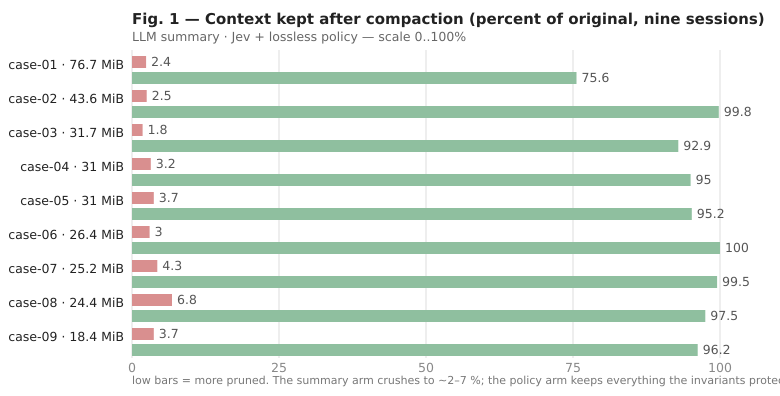
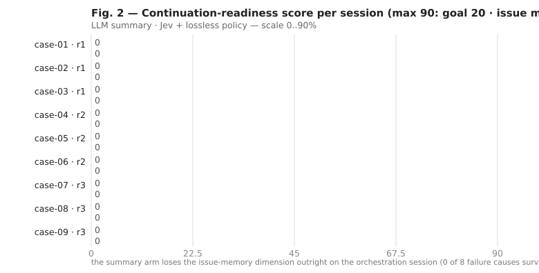
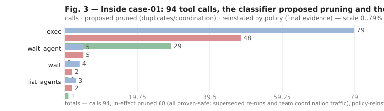

# JevCompact

**Lossless session compaction for LLM agents — optimized for Chinese.**

Long agent sessions eventually exceed the model's context window (and the proxy's
request-size limit — 413 "Payload Too Large" is the usual first sign). Every mainstream
harness (Claude Code `/compact`, Codex auto-compaction, ZCode compaction) resolves this the
same way: hand the history to an LLM and ask for a *summary*. The summary compresses ~95 % —
and silently paraphrases, distorts, and drops the facts you were relying on: the commit hash,
the test tally, the goal you set 20 rounds ago, the reason why attempt 17 failed. You then
find yourself maintaining a handover document per session to distribute the details the
summariser lost.

JevCompact takes a different approach: it **never rewrites text**. It asks the TypeSafe *Jev*
verifier one keep/drop decision per *tool call* (the bulk of any session is tool results —
superseded file reads, repeated commands, progress bars), and layers a **lossless policy** on
top that guarantees the parts that matter survive:

| policy rule (lib/policy.mjs) | guarantee |
|---|---|
| **I1** user text is classified, never rewritten | your instructions — in any language — come through byte-identical |
| **I2** calls carrying goal / correction-round / failure-cause evidence are force-kept | a 20-round debug loop keeps its plot |
| **I3** the last result of each command line is kept when it carries critical evidence (test tallies, commit hashes, errors, build results) | the continuation can still cite the evidence |

Measured on nine private archived sessions (details: `docs/EVIDENCE.md`):

| arm | anchors recalled | corrections retained | critical evidence kept | fabrications | mean compression | handover needed |
|---|---|---|---|---|---|---|
| LLM summary (the usual `/compact`) | 30 % | 41 % | 71 % | 45 | 0.035 | **yes, always** |
| Jev, bare classifier | 100 % | 100 % | **9 %** ⚠ | 0 | 0.362 | yes |
| **Jev + lossless policy** | 100 % | 100 % | **100 %** | **0** | 0.946* | **no — 9/9 sessions HANDOVER-FREE** |

\* on debug-loop-dominated sessions the policy keeps more — see
*Limitations and future work*: that is the price of losing nothing.

## Why it is optimized for Chinese

Text compaction by summarisation is lossy *for every* language, but worst for CJK: the
summariser tends to translate Cantonese/Traditional instructions into English and, in doing
so, normalises away the details — "批准套用及重開" becomes "approved to apply and reopen";
the 376/376 PASS is gone. JevCompact cannot paraphrase what it does not rewrite: **the policy
and the classifier only choose which messages to drop, never how to say them.** Its
correction/failure-detection patterns ship with Cantonese and Traditional-Chinese markers
(修改、重試、搞唔掂、錯晒、批准、由於、原因、係因為、導致 …) alongside the English ones, and the
default keep-threshold `0.6` was picked on a Cantonese benchmark corpus. Your 中文 stays
intact — 你啲字、句句保留。

## Install

Requirements: Node ≥ 22 (no runtime dependencies), and a TypeSafe API key
(<https://api.typesafe.ai>) — free tier available.

```sh
git clone https://github.com/cyrusasco/JevCompact.git
cd JevCompact
# key resolution order: --key= > $TYPESAFE_API_KEY > ./.env > ~/.claude/settings.json "env"
node bin/jevcompact.mjs --help
```

### Claude Code

```sh
# 1) the agent-facing skill
mkdir -p ~/.claude/skills && cp -r skills/jevcompact ~/.claude/skills/
# 2) optional: the MCP server (tools compact_messages / compact_jsonl, zero-dependency stdio JSON-RPC)
claude mcp add jevcompact -- node "<path>/JevCompact/lib/mcp-server.mjs"
```

### Codex CLI / Codex desktop

```md
<!-- ~/.codex/AGENTS.md -->
## Compaction — use JevCompact, not /compact
When a session nears the context limit, run:
  node <path>/JevCompact/bin/jevcompact.mjs <rollout.jsonl>            # dry run
  node <path>/JevCompact/bin/jevcompact.mjs <rollout.jsonl> --apply --in-place
Archives live under ~/.codex/archived_sessions; rollouts under ~/.codex/sessions.
Always read the printed decisions before passing --apply. A .pre-jev.bak is kept;
--restore <file> puts it back. Never compact a session whose subagents still run.
```

### ZCode

```sh
mkdir -p ~/.zcode/skills && cp -r skills/jevcompact ~/.zcode/skills/
# register the MCP server in ~/.zcode/cli/config.json → "mcp": { "servers": { "jevcompact": { … } } }
# host-only bonus: compact a live session directly from its database:
node bin/jevcompact.mjs --session <id|prefix|live>          # dry run
node bin/jevcompact.mjs --session <id|prefix|live> --apply  # in-place, verified backup first
```

## Usage

```sh
# dry run (default: prints the decisions, writes nothing — safe on live files)
node bin/jevcompact.mjs session.jsonl

# write: canonical pruned form to session.compact.jsonl (input untouched)
node bin/jevcompact.mjs session.jsonl --apply

# rewrite the file in its own format (claude jsonl / codex rollout), backup + verify first
node bin/jevcompact.mjs session.jsonl --apply --in-place
node bin/jevcompact.mjs --restore session.jsonl    # from session.jsonl.pre-jev.bak

# tune the read
node bin/jevcompact.mjs big.jsonl --threshold 0.6 --keep 6 --head 300
node bin/jevcompact.mjs big.jsonl --pin-last always    # report-heavy sessions: max safety
node bin/jevcompact.mjs big.jsonl --no-policy          # bare classifier (see EVIDENCE.md ⚠)
```

Formats read: Claude Code project JSONL, Codex rollouts (session_meta / response_item /
compacted boundary honoured), ZCode model-io rollouts, inline `Message[]` JSON. The library
is in `lib/`; every routine in `bin/jevcompact.mjs` maps back to a documented option.

## The evidence

Everything the README claims is measured, and the measurement is published: nine archived
sessions (18–77 MiB, the author's own, shipped nowhere), two arms, six dimensions, all
figures from the data.

| document | contents |
|---|---|
| [`docs/EVIDENCE.md`](docs/EVIDENCE.md) | protocol, the nine-session table, the anatomy of the audit session, reproduction commands |
| [`docs/IMPROVEMENT-PLAN.md`](docs/IMPROVEMENT-PLAN.md) | the two failure modes, the eleven-question consultation, the three invariants |
| [`docs/jev-consult.json`](docs/jev-consult.json) | the consultation in full — questions, repetitions, medians |
| [`docs/data/bench-results.json`](docs/data/bench-results.json) | the data file every figure is built from |







Figures are dependency-free SVG generated from the data file — `npm run data && npm run
charts` regenerates them; `npm run verify` is the gate described below.

## Privacy — what ships, and what never leaves your machine

JevCompact is built so that nothing of your sessions can travel with it:

- **nothing of a session is ever sent anywhere but the classification request.** The only
  network operation in the whole package is the keep/drop query to *your own* TypeSafe
  endpoint over TLS, authenticated by *your own* key (`--key=`, `$TYPESAFE_API_KEY`,
  `.env`, `~/.claude/settings.json`); the key is never logged, never written to disk, never
  echoed in a report. No telemetry, no update checks, no third-party calls.
- **the repository itself is the proof.** The corpus — the nine sessions behind every
  figure — lives on the author's machine and is distributed with nothing. The published
  documents quote counts only. The CI gate `npm run verify` scans the entire distribution
  for identifiers of the corpus (session ids, local paths, drive letters, commit hashes,
  project names, key material, pasted conversation text) and fails the build on its first
  finding — so a leak is not merely discouraged, it is unbuildable.
- **on your machine, compaction is reversible by construction.** Dry run is the default;
  `--apply` never touches the input unless `--in-place`, and `--in-place` keeps a
  verified `.pre-jev.bak` that `--restore` puts back.

## Limitations and future work

- **Compression vs. losslessness.** On sessions dominated by a long correction loop, the
  policy raises the reduction ratio from ~0.36 down to ~0.95 kept: everything the loop is,
  the loop keeps. Plain Q&A sessions still compact hard (~0.2–0.5 kept).
- **Calibration.** The classifier is trained mostly on English agent trajectories; for CJK
  sessions the shipped default `--threshold 0.6` is the sorted order of safety. Run dry
  first, read the decisions.
- **Roadmap:** session-type detection (auto `--pin-last`), semantic final-report pinning by
  querying the verifier per call, more localization (simplified-Chinese patterns are in the
  repository's issue list, pull requests welcome — see `docs/EVIDENCE.md` for the
  benchmark spec before contributing).

## License

MIT. `lib/dist/` derives from [fast-jev-compaction](https://github.com/tamaratran/fast-jev-compaction)
(MIT); see `NOTICE.md` and `lib/dist/LICENSE.upstream`.
